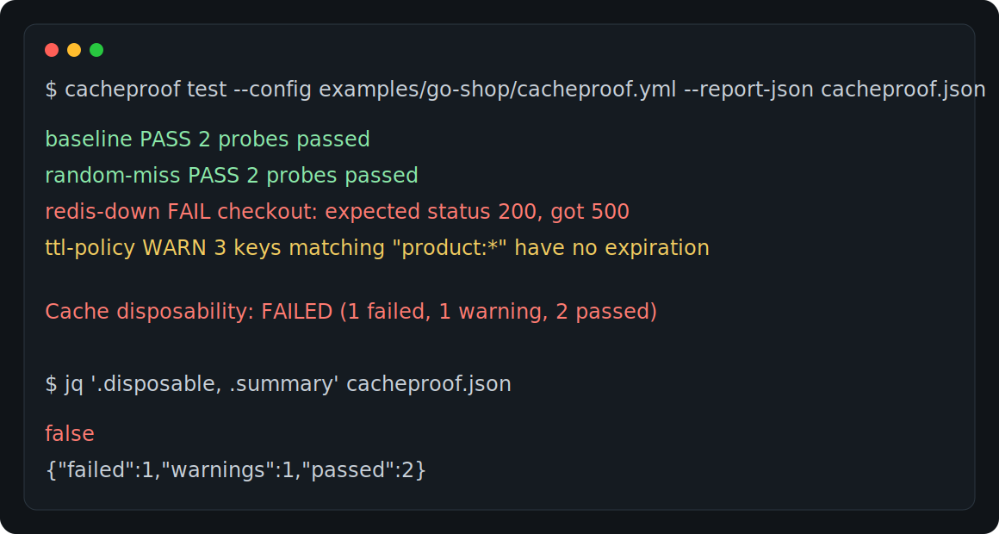

# CacheProof

Prove that your cache is disposable before production does it for you.

CacheProof is a CLI tool for teams that use Redis as a cache and want to know
what really happens when the cache misses, goes cold, or disappears. It runs a
local Redis-aware proxy, sends your own checks through the application, injects
cache failure scenarios, and reports whether the app still keeps its business
promises.



## Why it exists

Redis often starts as a cache and quietly turns into a second database. That is
fine until someone flushes it during an incident, a node restarts, a key expires
early, or a deployment points at an empty instance.

CacheProof catches that drift in a repeatable way. It does not guess from code.
It watches real Redis traffic from your app, runs a clean baseline, then repeats
the same probes under controlled cache failures.

## What it checks

- `baseline`: the application works before fault injection starts.
- `random_miss`: selected read commands return cache misses in a deterministic
  way.
- `redis_unavailable`: active Redis connections are closed and new ones are
  refused.
- `cold_cache`: explicitly disposable key patterns are deleted, with safety
  limits.
- Policy findings: suspicious commands, missing TTLs, large values, and apps
  that bypass the proxy entirely.

CacheProof writes a human terminal report, JSON for automation, and JUnit XML
for CI systems.

## How it works

Point your application at the CacheProof proxy instead of Redis:

```text
probes
  |
  v
your app  ->  CacheProof proxy  ->  real Redis
             127.0.0.1:6380      127.0.0.1:6379
```

The proxy forwards normal traffic byte-for-byte in pass-through mode. During a
scenario it changes only the Redis behavior needed for that scenario, records
safe metadata, and never stores raw keys, values, RESP frames, credentials, or
HTTP bodies.

## Quick start

Build or install the CLI:

```sh
go install ./cmd/cacheproof
```

Create a starter config:

```sh
cacheproof init
```

Run Redis and your app. In the app's test environment, set Redis to the proxy
address from `cacheproof.yml`, usually `127.0.0.1:6380`. Keep the real Redis
address as the upstream, usually `127.0.0.1:6379`.

Check the wiring:

```sh
cacheproof doctor --config cacheproof.yml
```

Run the cache contract:

```sh
cacheproof test \
  --config cacheproof.yml \
  --report-json cacheproof.json \
  --report-junit cacheproof.xml
```

## Minimal config

```yaml
version: 1

proxy:
  listen: "127.0.0.1:6380"
  upstream: "127.0.0.1:6379"

seed: 1
probe_timeout: "30s"
warmup_retries: 1
warmup_delay: "500ms"

scenarios:
  - name: random-miss
    type: random_miss
    probability: 0.30
  - name: redis-down
    type: redis_unavailable

probes:
  - name: catalog
    http:
      method: GET
      url: "http://127.0.0.1:8000/catalog/42"
    assert:
      expect: pass
      status: 200
```

`cacheproof init` writes a fuller, safe starter file. It does not enable
`cold_cache` by default because that scenario deletes keys.

## CLI commands

```sh
cacheproof init
cacheproof doctor --config cacheproof.yml
cacheproof test --config cacheproof.yml
cacheproof version
```

Useful `test` flags:

- `--only <scenario>` runs the baseline and then one named scenario.
- `--no-warmup` disables warm-up probes.
- `--fail-on warn` treats warnings as a failing result.
- `--report-json <path>` writes the JSON report.
- `--report-junit <path>` writes a JUnit XML report.
- `--allow-unsafe-commands` enables shell probes.
- `--allow-remote-destructive` allows `cold_cache` against non-loopback Redis.

## Exit codes

| Code | Meaning |
| --- | --- |
| `0` | The cache contract passed. |
| `1` | A probe or finding failed, or warnings failed under `--fail-on warn`. |
| `2` | CLI usage or configuration is invalid. |
| `3` | Infrastructure failed: Redis upstream, proxy startup, context, or internals. |

## Example app

The repository includes `examples/go-shop`, a tiny service that uses Redis for
catalog and checkout paths. Its config shows the intended shape of an end-to-end
run:

```sh
docker compose -f examples/go-shop/docker-compose.yml up -d redis

cd examples/go-shop
REDIS_ADDR=127.0.0.1:6380 SHOP_ADDR=127.0.0.1:8000 go run .

cd ../..
cacheproof test --config examples/go-shop/cacheproof.yml
```

The point of the example is not that every scenario passes. The useful signal is
which business path survives cache loss and which one still depends on Redis too
much.

## CI use

CacheProof is meant to run as a build step after the app and Redis are healthy:

```sh
cacheproof doctor --config cacheproof.yml
cacheproof test \
  --config cacheproof.yml \
  --report-json cacheproof.json \
  --report-junit cacheproof.xml
```

Store the JSON and JUnit files as CI artifacts. Use the process exit code to
fail the job.

## Scope

CacheProof v1 is intentionally small:

- one Redis upstream;
- RESP2 plus the RESP3 behavior needed for common clients;
- HTTP probes and command probes;
- terminal, JSON, and JUnit reports;
- no web UI, no production traffic capture, no Redis Cluster, no Sentinel, no
  TLS, no Memcached, and no load testing.

Those limits keep the tool boring enough to trust in CI.

## Development

Run the test suite:

```sh
go test ./...
```

Run the race checks:

```sh
go test -race ./...
```

Build the binary:

```sh
CGO_ENABLED=0 go build -trimpath -ldflags "-s -w -X main.version=dev" -o cacheproof ./cmd/cacheproof
```
